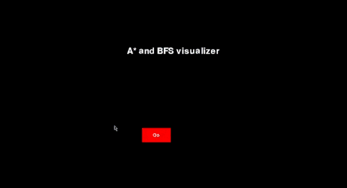

# Pathfinding Algorithms Visualizer
### An application built using ```PyGame``` to visualize the Breadth First Search algorithm and A* algorithm.  

  
# Installation
1. ```git clone https://github.com/iyoushe1703/Pathfinding-Visualizer.git```
2. ```pip install -r requirements.txt```
3.  ```python starting.py```

# Steps to run
1. After the app loads, click 'Go'.
2. Hover over a cell and press the key S to mark it as the start node.
3. Hover over another cell and the press the key E to mark it as the end node.
4. On the right, click on BFS or A* to run the visualtion.

# A* Visualization

  
  
# BFS Visualization

  